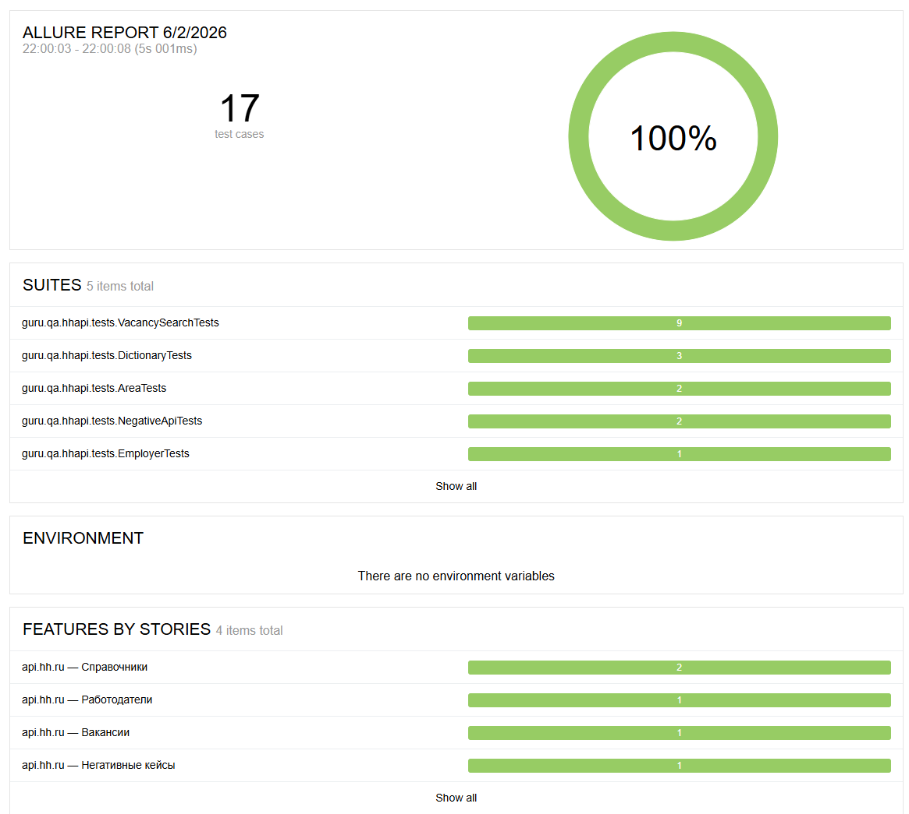

# 🌐 hh.ru — API Automated Tests

Автоматизированные API-тесты для эндпоинтов hh.ru, реализованные на **REST-assured**, **JUnit 5**, **Gradle** и **Allure**. Модели на **Lombok**, спецификации на **RequestSpecBuilder**, кастомные Allure-шаблоны для request/response.

Часть дипломного проекта **QA.Guru** (Java Base): [UI](https://github.com/sadchill82/hh-ui-tests) / API / [Mobile](https://github.com/sadchill82/hh-mobile-tests) / [Manual](https://github.com/sadchill82/hh-manual-tests).

Поддерживается два режима: `mock` (WireMock, по умолчанию — CI всегда зелёный) и `live` (настоящий `api.hh.ru` с OAuth-токеном зарегистрированного приложения).

---

## 🔧 Стек технологий

| Инструмент | Назначение |
|---|---|
| [](https://openjdk.org/projects/jdk/21/) | Язык программирования |
| [](https://gradle.org/) | Система сборки |
| [](https://rest-assured.io/) | HTTP-клиент для тестов |
| [](https://junit.org/junit5/) | Тестовый фреймворк |
| [](https://docs.qameta.io/allure/) | Отчёты о тестах |
| [](https://projectlombok.org/) | Аннотации для моделей |
| [](https://wiremock.org/) | Mock-сервер для стабов |
| [](https://github.com/FasterXML/jackson) | Сериализация / snake_case |
| [](https://jenkins.autotests.cloud/) | Continuous Integration |

---

## 📁 Структура проекта

```
hh-api-tests/
├─ build.gradle.kts
├─ gradlew, gradlew.bat
├─ images/                   — скриншоты Jenkins/Allure/Telegram для README
└─ src/test/
   ├─ java/guru/qa/hhapi/
   │  ├─ api/                — Step-классы: Vacancy/Area/Employer/DictionaryApi
   │  ├─ config/             — ApiConfig + Project (mock/live переключатель)
   │  ├─ helpers/            — CustomAllureRestAssured
   │  ├─ models/             — Vacancy, VacanciesResponse, Salary, Employer, Area
   │  ├─ specs/              — HhSpecs (request / response)
   │  ├─ support/            — WireMockServerHolder
   │  └─ tests/              — BaseApiTest + 5 классов тестов
   └─ resources/
      ├─ config/
      │  ├─ mock.properties  — профиль mock (default)
      │  └─ live.properties  — профиль live (api.hh.ru + OAuth)
      ├─ tpl/                — http-request.ftl, http-response.ftl
      └─ wiremock/           — mappings + __files (только для mock-режима)
```

---

## 🚀 Запуск

### 📌 Предусловия

- Java 21
- Gradle (через `./gradlew`)

### ▶️ Mock-режим (по умолчанию)

```bash
./gradlew test
```

WireMock поднимается в `@BeforeAll` на случайном порту, выключается shutdown-хуком. Внешний сервис не нужен.

### ▶️ Live-режим (api.hh.ru)

Требуется access_token от приложения, зарегистрированного на [dev.hh.ru/admin](https://dev.hh.ru/admin).

```bash
./gradlew test -Denv=live "-DhhToken=$env:HH_TOKEN"
```

`NegativeApiTests` автоматически скипается в live-режиме (проверяет shape ошибок WireMock).

### Параметры

| Ключ | По умолчанию | Описание |
|---|---|---|
| `env` | `mock` | `mock` → WireMock, `live` → api.hh.ru |
| `baseUri` | из `<env>.properties` | целевой API (актуально для `live`) |
| `hhToken` | пусто | OAuth-токен Bearer (актуально для `live`) |

---

## 🔑 Получение OAuth-токена

1. Зарегистрировать приложение на [dev.hh.ru/admin](https://dev.hh.ru/admin) — получить `client_id` и `client_secret`.
2. Получить токен через `client_credentials` grant в PowerShell:

```powershell
$r = Invoke-RestMethod -Method POST -Uri "https://hh.ru/oauth/token" `
    -Headers @{ "User-Agent" = "hh-tests/1.0 (sadchill82@yandex.ru)" } `
    -Body @{
        grant_type    = "client_credentials"
        client_id     = "ВАШ_CLIENT_ID"
        client_secret = "ВАШ_CLIENT_SECRET"
    }
$env:HH_TOKEN = $r.access_token
[Environment]::SetEnvironmentVariable("HH_TOKEN", $r.access_token, "User")
```

---

## 🔌 Про WireMock-режим

Изначально целил на живой `api.hh.ru` без авторизации. Что получилось:

- `/areas`, `/dictionaries` — работают без авторизации
- `/vacancies`, `/employers` — `403 Forbidden` без OAuth-токена
- User-Agent проверяется по чёрному списку, `example.com` отдаёт `400 blacklisted` ([BUG-002](https://github.com/sadchill82/hh-manual-tests/blob/main/bugs/BUG-002-api-blacklist-example-com.md))

WireMock-фикстуры построены один в один под схему hh.ru: `snake_case`, реальные id (Москва = 1, Россия = 113), реальные компании. После регистрации приложения на dev.hh.ru добавился live-режим, но mock остался дефолтом — для CI и быстрых прогонов.

---

## 📊 Jenkins и Allure

**Jenkins Job:**
[Перейти к Jenkins](https://jenkins.autotests.cloud/job/C39-sadchill82-hh-api-tests/)

**Allure Report:**
[Перейти к Allure](https://jenkins.autotests.cloud/job/C39-sadchill82-hh-api-tests/allure)

### Скриншот Allure-отчёта



### Генерация отчёта локально

```bash
./gradlew allureServe
```

В `src/test/resources/tpl/` лежат кастомные Freemarker-шаблоны:

- **`http-request.ftl`** — карточка запроса: метод, URL, headers, body, cURL
- **`http-response.ftl`** — карточка ответа: цветной статус, headers, тело

Подключены через `CustomAllureRestAssured.withTemplates()` в `HhSpecs`.

---

## ✅ Покрытие тестами

**17 тестов:**

| Класс | Тесты | Mock | Live |
|---|---|---|---|
| **VacancySearchTests** | базовый поиск, параметризованный (QA Automation, Java, Python, DevOps), фильтр `area=1`, `only_with_salary`, `per_page`, GET по id | ✅ | ✅ |
| **AreaTests** | дерево `/areas` с Россией (id=113), `/areas/1` → Москва | ✅ | ✅ |
| **DictionaryTests** | experience, employment, currency | ✅ | ✅ |
| **EmployerTests** | поиск по компании | ✅ | ✅ |
| **NegativeApiTests** | 404 для `GET /vacancies/0`, 400 для `per_page=999` | ✅ | skip |
